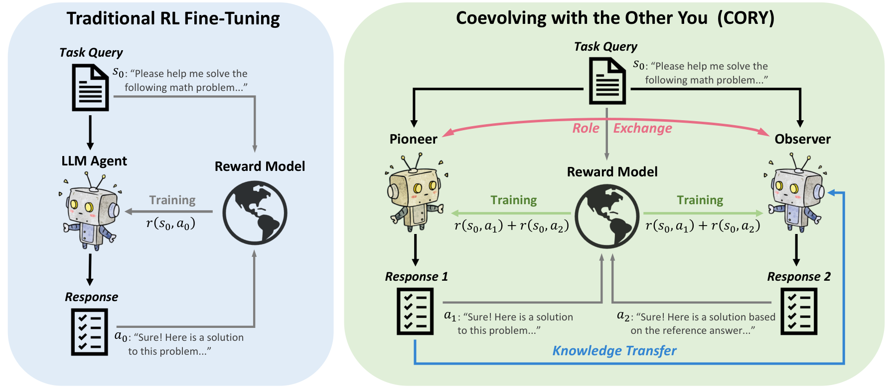
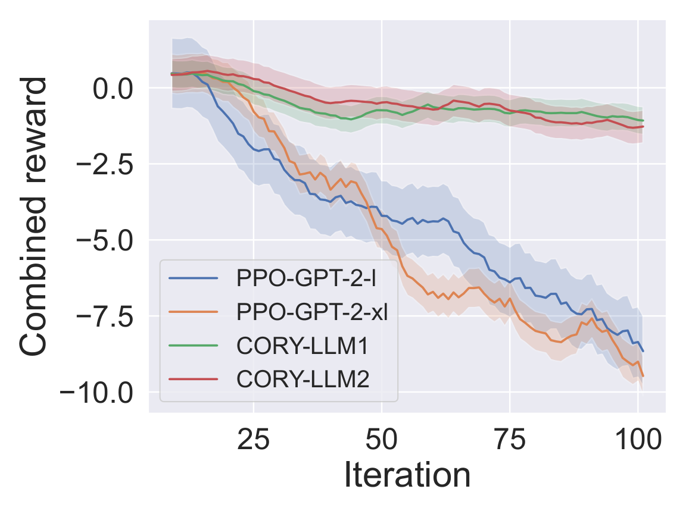
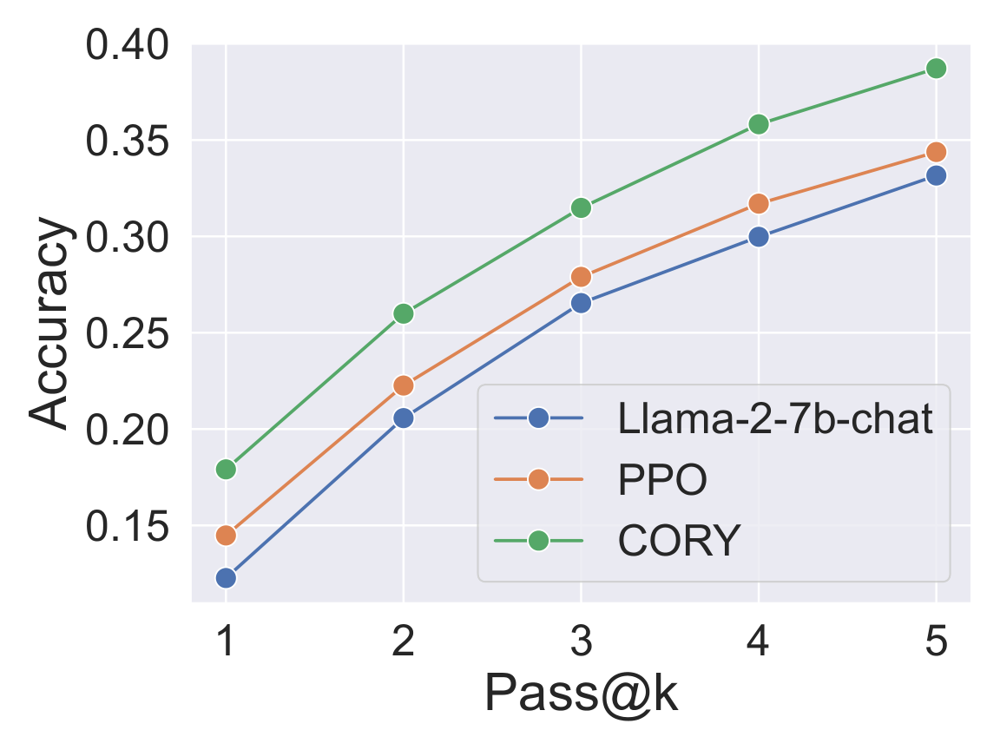
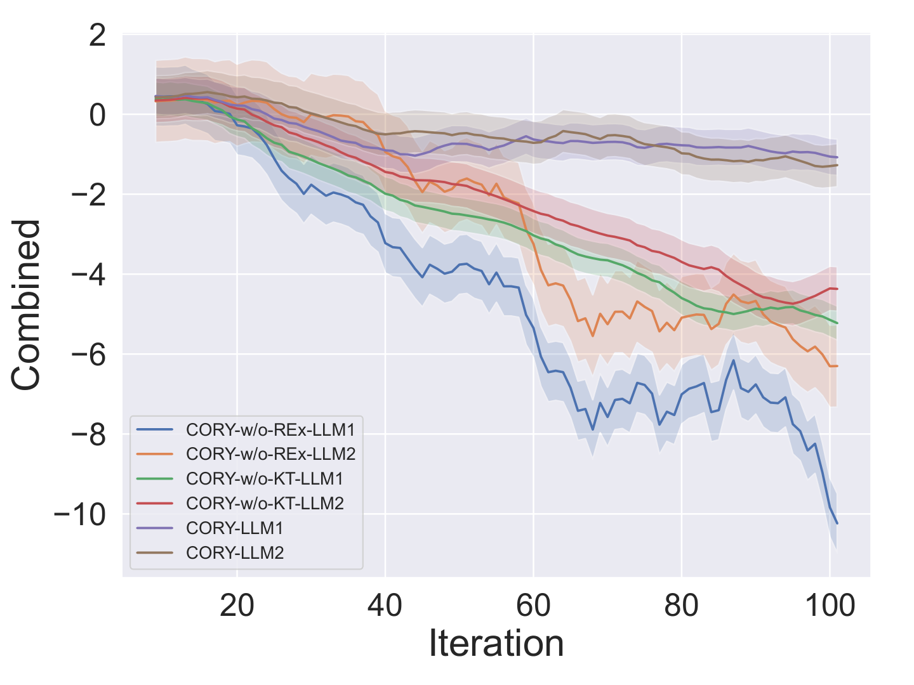

# Coevolving with the Other You (CORY)

[English](README.md) | [中文](README_CN.md)

[](https://nips.cc/Conferences/2024)
[](https://arxiv.org/abs/2410.06101)
[](https://www.python.org/downloads/)
[](https://pytorch.org/)

---

## 🏛️ About This Repository

This repository is maintained by **[CASIA-Collect-AI](https://github.com/CASIA-Collect-AI)** as part of a curated collection of high-quality research code at the intersection of MARL and LLMs.

📌 **Original Repository (Recommended):** [Harry67Hu/CORY](https://github.com/Harry67Hu/CORY)
⭐ **If this work is helpful, please Star the original repository to support the authors!**

🔗 **MARL Framework:** [HMAP/HMP2G](https://github.com/binary-husky/hmp2g) — Companion experimental framework for multi-agent RL research.

> **Team:** Intelligent Flight Technology Team (Swarm Intelligence Group), Institute of Automation, Chinese Academy of Sciences (CASIA), led by Prof. Zhiqiang Pu.
> CASIA-Collect-AI curates and maintains high-quality open-source research code in MARL, LLM, and robotics.

---

Official implementation of **Coevolving with the Other You: Fine-Tuning LLM with Sequential Cooperative Multi-Agent Reinforcement Learning** (NeurIPS 2024).

**Authors:** Hao Ma\* (Co-First), Tianyi Hu\* (Co-First), Zhiqiang Pu, Boyin Liu, Xiaolin Ai, Yanyan Liang, Min Chen
**Affiliations:** University of Chinese Academy of Sciences; Institute of Automation, Chinese Academy of Sciences; Alibaba (China) Co., Ltd.; Macau University of Science and Technology

---

## Abstract

RL has emerged as a pivotal technique for fine-tuning LLMs on specific tasks. However, prevailing methods predominantly rely on PPO and variants, which often exhibit suboptimal performance and vulnerability to **distribution collapse** when applied to LLM fine-tuning.

We propose **CORY**, extending RL fine-tuning of LLMs to a sequential cooperative multi-agent RL framework, leveraging the inherent coevolution and emergent capabilities of multi-agent systems. CORY splits an LLM into two agents — a **Pioneer** and an **Observer** — and trains them in a cooperative sequential manner. The framework simultaneously improves task performance and mitigates distribution collapse.

---

## 📖 Paper Deep Dive

### The Problem: Two Bottlenecks of PPO in LLM Fine-Tuning

Reinforcement learning fine-tuning of large language models (e.g., RLHF) has become a mainstream technique, but PPO faces two core problems in LLM fine-tuning:

1. **Suboptimal Policy Learning:** Single-agent PPO easily gets trapped in local optima, especially when rewards are sparse or non-convex.
2. **Distribution Collapse:** In pursuit of high rewards, the model drifts away from the pre-training distribution, causing degraded output (repetition, semantic drift), with KL divergence rising sharply.

**Core Intuition:** If two co-evolving agents learn from each other and mutually constrain each other's behavior, can we overcome these single-agent failure modes?

---

### CORY Method

#### Dual-Agent Design: Pioneer and Observer

The LLM is duplicated into two autonomous agents:

| Role | Input | Task |
|------|-------|------|
| **Pioneer** | Query `q` | Directly generates answer `a₁` |
| **Observer** | Query `q` + Pioneer's answer `a₁` | Generates answer `a₂` given Pioneer's reference |

The Observer sees the Pioneer's output and essentially learns "how to improve a peer's answer," forming a knowledge transfer chain.


*Overview of the CORY framework: Pioneer generates initial responses, Observer refines based on Pioneer's output.*

#### Cooperative Reward: Joint Optimization

Both agents share a **collective reward**:

```
r_CORY(s₀, a₁, a₂) = r(s₀, a₁) + r(s₀, a₂)
```

This means a poor Pioneer response not only hurts itself but also penalizes the Observer — incentivizing genuine cooperation.

#### Periodic Role Exchange

Every `T_exchange` steps, Pioneer and Observer **swap roles**: the original Observer becomes the new Pioneer. This cross-training ensures:
- Both agents benefit from both generation modes (independent + reference-conditioned)
- Neither agent specializes too narrowly in one role
- Mutual constraints prevent distribution collapse

**Why role exchange prevents distribution collapse:** When the Observer always sees the Pioneer's reference, it has a natural "anchor" that prevents wild deviations from the training distribution. The Pioneer, knowing its output will be used as a reference, is also incentivized to stay coherent.

---

### Experimental Results

#### Sentiment Fine-Tuning (IMDB)

Task: Fine-tune LLM to generate positive movie reviews.


*Reward curves on the IMDB sentiment task. CORY achieves higher final reward with less variance compared to PPO baselines.*

**Key findings:**
- CORY achieves significantly higher positive sentiment scores than PPO, NLPO, and TRPO baselines
- Distribution collapse (measured by KL divergence spike) is substantially reduced in CORY

#### Arithmetic Reasoning (GSM8K)

Task: Fine-tune LLM for grade-school math problem solving.


*Accuracy on GSM8K arithmetic reasoning benchmark. CORY consistently outperforms single-agent RL approaches.*

**Key findings:**
- CORY improves GSM8K accuracy by 3–5% over best PPO baselines
- The Observer's access to Pioneer reasoning chains acts as implicit chain-of-thought augmentation

#### Ablation Studies


*Ablation study showing the contribution of each component: cooperative reward, role exchange, and dual-agent architecture.*

**Ablation findings:**
- Removing role exchange causes performance to degrade to near-PPO level
- Removing cooperative reward eliminates the mutual constraint, leading to distribution collapse
- Both components are necessary and jointly sufficient for CORY's gains

---

## Installation

```bash
conda create --name cory python=3.10
conda activate cory
pip install -r requirements.txt
```

**Dependencies:** PyTorch 2.2+, Transformers 4.37+, trl, peft, accelerate

---

## Quick Start

### Sentiment Fine-Tuning (IMDB)

```bash
python train.py \
  --task imdb \
  --model_name gpt2 \
  --method cory \
  --exchange_steps 100
```

### Arithmetic Reasoning (GSM8K)

```bash
python train.py \
  --task gsm8k \
  --model_name meta-llama/Llama-2-7b-hf \
  --method cory \
  --exchange_steps 200
```

---

## Citation

```bibtex
@inproceedings{ma2024cory,
  title={Coevolving with the Other You: Fine-Tuning LLM with Sequential Cooperative Multi-Agent Reinforcement Learning},
  author={Ma, Hao and Hu, Tianyi and Pu, Zhiqiang and Liu, Boyin and Ai, Xiaolin and Liang, Yanyan and Chen, Min},
  booktitle={Advances in Neural Information Processing Systems (NeurIPS 2024)},
  year={2024}
}
```

---

## Contact

- **Co-First Authors:** Hao Ma, Tianyi Hu — hutianyi2021@ia.ac.cn
- **Corresponding Author:** zhiqiang.pu@ia.ac.cn (Prof. Zhiqiang Pu)
